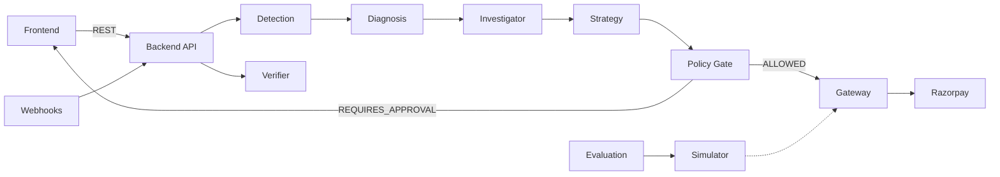

# PulseRecover


**AI payment reliability & revenue recovery engine**

Probabilistic AI proposes. Deterministic policy decides. Every quantitative claim is independently falsifiable.

## What it does

PulseRecover monitors a merchant's payment stream, detects success-rate degradations, diagnoses root cause with an ML model, quantifies revenue at risk, and executes **bounded, policy-gated recovery actions** (retries, payment links) through Razorpay — then verifies every recovery with signature-verified webhooks and measures recovered revenue against ground truth.

**Detect → diagnose → quantify → gate → execute → verify → measure** — the loop is closed, and every link is independently checkable.

## Key features

- **Anomaly detection** on `payment.failed` / `payment.captured` streams with configurable windows and evidence-gated incident lifecycle
- **ML root-cause diagnosis** — 8-class scikit-learn classifier on 58 windowed features; heuristic fallback with confidences capped ≤ 0.7 when no artifact is present
- **Deterministic policy gate** — pure, inspectable YAML rules; AI output is only ever an *input*; no auto-execute on unsafe classes; refunds are never on the allowlist
- **Idempotent execution** — unique `gateway_request_id` per action; duplicate protection; `UNKNOWN` outcomes never count as recovered
- **Webhook verification** — raw-body HMAC-SHA256, constant-time compare, `x-razorpay-event-id` deduplication, out-of-order-safe handlers
- **Evaluation harness** — deterministic simulator with ground truth; randomized holdout lift with Newcombe 95% CIs; pre-registered estimands
- **Full audit trail** — immutable `policy_decisions`, hash-chained `audit_logs`, every BLOCKED decision mirrored to audit

## Quick start

### Prerequisites

- Python 3.12+ (developed on 3.14.5)
- Node.js ≥ 20
- Docker & Docker Compose (optional, for Postgres)

### Install

```bash
cp .env.example .env        # defaults: simulation mode, SQLite, no keys needed
make setup                  # creates venv + installs backend deps
```

### Run

```bash
# Backend (default: SQLite + simulator)
make backend                # http://localhost:8000

# Frontend
cd frontend
npm install
cp .env.example .env.local   # NEXT_PUBLIC_API_BASE_URL=http://localhost:8000
npm run dev                  # http://localhost:3000
```

### Docker (Postgres)

```bash
make compose-up             # Postgres 16 + backend + frontend
```

The active ML diagnosis artifact is committed to the repo and copied into the backend image, so container and local demos run identical deterministic diagnosis.

## Configuration

| Variable | Description | Default |
|---|---|---|
| `DATABASE_URL` | Database connection string | `sqlite:///./pulserecover.db` |
| `APP_ENV` | Environment (`dev` / `prod`) | `dev` |
| `SIMULATION_MODE` | Use simulator instead of live Razorpay | `true` |
| `RAZORPAY_KEY_ID` | Razorpay API key ID | |
| `RAZORPAY_KEY_SECRET` | Razorpay API secret | |
| `RAZORPAY_WEBHOOK_SECRET` | Webhook HMAC secret | |
| `LLM_PROVIDER` | LLM provider (`none` / `openai` / `pollinations`) | `none` |
| `API_KEY` | Shared secret for mutating routes | `dev-key` |
| `POLICY_FILE` | Path to deterministic policy YAML | `policies/default.yaml` |
| `CORS_ORIGINS` | Allowed CORS origins | `["http://localhost:3000"]` |
| `LOG_LEVEL` | Logging level | `INFO` |

Health endpoints:
- `GET /healthz` — Liveness
- `GET /readyz` — Readiness (DB check)
- `GET /api/v1/system/health` — Full system status (DB, policy, LLM, gateway mode)

## Testing

```bash
# Backend unit + integration tests (678)
make test

# Playwright e2e (7)
cd frontend && npm run test:e2e

# Deterministic demo scenarios
cd backend && .venv/Scripts/python scripts/demo_run.py --scenario all
```

## Architecture

Modular monolith (FastAPI) with a `PaymentGateway` port implemented by both the Razorpay test-mode adapter and the simulator.



Full detail: [docs/architecture.md](docs/architecture.md).

## Documentation

| Document | Description |
|---|---|
| [docs/index.md](docs/index.md) | Documentation index |
| [docs/architecture.md](docs/architecture.md) | Architecture, sequence diagrams, ports, safety model |
| [docs/policy.md](docs/policy.md) | Deterministic policy engine reference |
| [docs/ml.md](docs/ml.md) | Diagnosis methodology, model comparison, artifact lifecycle |
| [docs/evaluation.md](docs/evaluation.md) | Harness design, reproduced metrics, honest limitations |
| [docs/demo.md](docs/demo.md) | 5 deterministic scenarios with verbatim expected output |
| [docs/payment-invariants.md](docs/payment-invariants.md) | 12 payment-action invariants and their proving tests |
| [docs/razorpay-integration.md](docs/razorpay-integration.md) | Test-mode setup, idempotency, webhook verification |
| [docs/worker.md](docs/worker.md) | Worker tier, delayed retries, reconciliation sweep |

## Verification

Every quantitative claim maps to run id, named test, or document in [docs/claim-matrix.md](docs/claim-matrix.md):

1. **678 backend tests + 7 Playwright e2e** — including the 12 payment-action invariants and the concurrent-execute regression test
2. **Canonical evaluation** — one pinned command reproduces headline metrics; pairwise bit-identical across consecutive runs
3. **Container-verified demo** — full loop on docker compose in ~5 minutes

## Known limitations

- **Simulator fidelity** — evaluation and ML metrics are measured on synthetic data; real Razorpay traffic will be noisier
- **Single-merchant** — no multi-tenant isolation yet
- **Demo-grade auth** — approver identity is self-declared; GETs are unauthenticated by design
- **Synchronous evaluation** — full evaluation blocks for minutes; CLI is the intended path
- **Worker tier** — implemented but default off; single-node in-process

## Contributing

This is an AI Buildathon submission. Issues and forks are welcome.

## License

MIT
