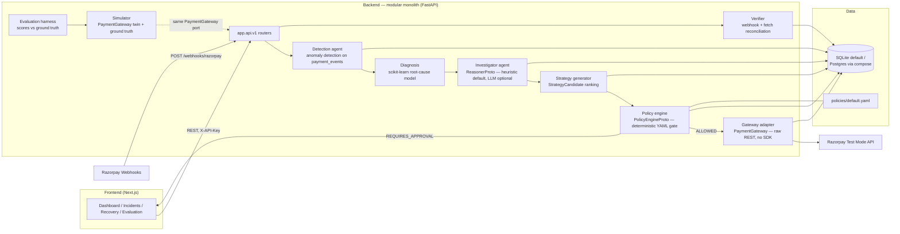

# PulseRecover

**AI payment reliability & revenue recovery engine** — Razorpay AI Buildathon, Track 03.

> **Probabilistic AI proposes. Deterministic policy decides.**
> Payment infrastructure executes. Verification proves.

PulseRecover watches a merchant's payment stream, detects success-rate
degradations, diagnoses the root cause with an ML model, quantifies the
revenue at risk, and executes **bounded, policy-gated recovery actions**
(retries, payment links) through Razorpay — then *proves* every recovery with
signature-verified webhooks and measures the recovered revenue against ground
truth.

**Reading the numbers in this README:** every metric is a real, reproduced
output of this repository — the command that produces it is always shown.
Evaluation and ML numbers are measured against the built-in **simulator's**
ground truth (synthetic data, documented fidelity bounds), not real Razorpay
traffic; the demo transcripts are verbatim output of `scripts/demo_run.py`;
nothing is a vendor claim. Where a number comes from a probabilistic
component (ML diagnosis, LLM reasoner) versus a deterministic one (policy
gate, verification), the text says so.

---

## The problem

Card/UPI/netbanking payments fail for two very different reasons:

- **Infrastructure** — gateway degradations, bank downtime, method outages,
  route latency. These failures are *recoverable*: the customer intended to
  pay, and a well-timed retry or a payment link often converts.
- **Customer intent** — insufficient funds, incorrect OTP, abandoned
  checkout. These need nudges and links, not blind retries — and hard
  declines should never be resubmitted at all (card-network guidance caps
  resubmissions at ~15 per 30 days).

Merchants today see an aggregate success-rate dashboard and, at best, apply
the industry-default response: **retry every failed payment once**. That
treats a bank outage and an expired card identically, cannot tell the 2pm
gateway degradation from organic noise, risks network penalties on
never-approve declines, and — critically — never *verifies* what was actually
recovered.

## Why it matters

- **Failed transactions are revenue at risk, not revenue lost** — but only if
  someone distinguishes the recoverable slice and acts on it while the
  customer still cares.
- **Indiscriminate retrying is expensive and unsafe**: it burns network
  attempt budgets, re-pings customers who opted out, and can double-collect
  when outcomes are ambiguous.
- **Unverified recovery claims are anecdotes.** "We recovered ₹X" means
  nothing unless each recovery is tied to a gateway-confirmed capture and the
  campaign is measured against what was actually wrong.

PulseRecover closes that loop: detect → diagnose → quantify → gate → execute
→ **verify** → measure.

## Differentiation — the open lane

Razorpay already ships *pieces* of revenue recovery (full analysis with
sources in [docs/research.md](docs/research.md)):

| Razorpay capability | What it does | What it doesn't do |
|---|---|---|
| Subscriptions "Smart Payment Retries" | Fixed T+1/T+2/T+3 auto-retry of failed recurring charges | Not configurable; no decline-code awareness; missed cycles never re-attempted after `halted` |
| Failed Payment Recovery | Auto-sends a payment link after checkout failure | One-time checkout only; no diagnosis of *why* failures cluster |
| Intelligent Payment Retry | In-checkout next-best-action nudge | Checkout UX only; no autonomous scheduled recovery |
| Optimizer (Infinity Router) | Enterprise AI routing across gateways | Razorpay-side and opaque; no merchant-side anomaly alerting |
| Agent Studio "Subscription Recovery Agent" (announced FTX'26) | Outreach/voice recovery agent | Nothing published on SR-degradation detection/diagnosis or bounded, verified execution |

**The open lane PulseRecover occupies:** the full merchant-side loop —
detect a success-rate anomaly on the merchant's own `payment.failed` stream →
diagnose the failing bank/method/error cluster with ML → quantify revenue at
risk → select the *safest* intervention under a deterministic, auditable
policy → execute bounded actions → verify via signature-checked webhooks →
measure recovered ₹ against ground truth. Nothing Razorpay documents today
does that loop, and the Track 03 brief ("measured money recovered… stopping
rules… audit trail") describes exactly it.

## Architecture

Modular monolith (ADR 0001): one FastAPI process, strictly separated modules
coupled only through `backend/app/ports.py`. The simulator and the Razorpay
test-mode adapter implement the **same `PaymentGateway` port**, so the entire
loop runs unchanged in both modes.



The closed loop, end to end: webhook intake (HMAC-verified, deduped) →
detection opens an incident → ML diagnosis + AI investigation →
revenue-at-risk quantification → per-payment recovery opportunities with
ranked strategies → **every** action through the deterministic policy gate →
execution with a unique `gateway_request_id` (idempotency) → webhook/fetch
verification → recovered-revenue ledger. Full detail, including the sequence
diagram and request-traceability story:
[docs/architecture.md](docs/architecture.md).

## Demo

Five deterministic, resettable scenarios — nothing mocked, nothing forced.
Each run seeds the simulator with a fixed seed and date, then drives the real
pipeline over HTTP. Every number below is copied from a real, reproduced run;
`backend/tests/demo/` re-runs each scenario twice and asserts the key numbers
are identical.

```bash
cd backend
.venv/Scripts/python scripts/demo_run.py --scenario A --db scripts/.demo_A.db   # one scenario
.venv/Scripts/python scripts/demo_run.py --scenario all --db scripts/.demo.db   # all five (~2 min)
.venv/Scripts/python -m pytest tests/demo -v                                    # the proof suite
```

(`--db` is a scratch file the script deletes and recreates; the app database
is never touched. Entity ids are uuid4 by design and differ between runs;
every *number* is identical.)

| Scenario | Proves |
|---|---|
| **A** — Major degradation | Full closed loop on a 2.5h gateway degradation over ~144k events: detection, ML diagnosis, 1,715 opportunities, one approval-lane recovery + two auto-executions, all webhook-verified |
| **B** — Safe autonomous recovery | ₹501 timeout retry, confidence 0.98 ≥ 0.85 floor → `auto_execute.ok`, fired with no human in the loop, webhook-verified |
| **C** — Human approval lane | ₹10,143 retry → `REQUIRES_APPROVAL` (`approval.amount`), sits in `PENDING_APPROVAL` until `human:ops` approves, then executes once |
| **D** — Gateway timeout | Mutating call 503s → action `UNKNOWN`, **no blind retry**; re-execute is a GET-only re-query (1 mutation total); resolves to `RECOVERED` on gateway evidence |
| **E** — Unsafe AI blocked | A manipulated AI proposes a ₹543 refund at 0.99 confidence → gate matches `allowlist` + `never_auto_execute.refund` → `REJECTED`, **0 gateway calls** |

Real output (verbatim, scenario A — ids projected out):

```
[DETECT] POST /api/v1/detection/run - metric=payment_success_rate, window=240m, bucket=10m, anchored 2026-08-15 11:25 UTC
        anomaly -> incident inc_...: success rate 82.9% -> 69.0% (-16.69%), severity=MEDIUM
        blast radius: 1359 failed payments, Rs 10,36,582 at risk
[DIAGNOSE] ML root-cause: gateway_degradation (confidence 0.8997, model diagnosis-logistic_regression@v20260826T234303Z-c5434878)
[QUANTIFY] POST /api/v1/recovery/opportunities/build -> 1715 per-payment opportunities (Rs 13,02,241 of failed payments in scope)
[POLICY] gate: REQUIRES_APPROVAL (rules: approval.amount, approval.confidence) - Rs 8,047 is above the Rs 5,000 auto-execute ceiling; routing to a human
[VERIFY] webhook payment.captured (HMAC signature valid, event id deduped) -> action RECOVERED - Rs 8,047 recovered
[POLICY] gate: ALLOWED (rules: auto_execute.ok) - auto-execute lane (<= Rs 5,000, confidence >= 0.85)
[VERIFY] webhook payment.captured ... -> action RECOVERED - Rs 504 / Rs 509 recovered
[RESULT] 3/3 executions verified RECOVERED - Rs 9,060 of Rs 10,36,582 at risk recovered in this run
```

Full narratives and expected outputs for all five:
[docs/demo.md](docs/demo.md).

## AI architecture

**Default mode is a deterministic, offline heuristic reasoner. The LLM
reasoner is optional and advisory only.** Neither mode can move money
([docs/agent.md](docs/agent.md), ADR 0004).

- The investigator agent turns an incident into a structured, auditable
  report: observed facts (each citing tool name + evidence row ids), labeled
  AI inferences with confidence, revenue implications, and a recommended
  action whose **policy outcome is previewed by the real policy engine**.
- **Tool whitelist.** Reasoners call tools only through
  `AgentTools.call(name, args)`; any other name raises `ToolNotAllowed`, and
  two rogue LLM tool calls abort the run. There is no arbitrary-callable
  path. The reasoner never receives secrets, raw DB access, or gateway
  access.
- **Mutation path = exactly two tools** (`request_payment_link`,
  `request_recovery_execution`), and they only create a `PROPOSED` row
  evaluated through the policy gate — the amount is copied from the original
  payment row, never from AI text. They never call the gateway.
- **Hallucination guard (LLM mode).** Every numeric financial claim must
  exactly match a number returned by a tool in the same run; unverifiable
  claims are stripped and the report flagged `degraded`. If validation fails
  after a retry, the run falls back to the heuristic reasoner.
- The heuristic reasoner is fully deterministic (same DB state →
  byte-identical report), escalates to a human on low confidence or thin
  evidence, and works with no network and no API keys.

## ML architecture — root-cause diagnosis

A scikit-learn classifier labels each detected incident with one of 8 root
causes (`gateway_degradation`, `route_latency`, `method_outage`,
`bank_downtime`, `abandonment_spike`, `subscription_failure_spike`,
`customer_insufficient_funds_wave`, `no_fault`) from **58 windowed features**
(volume/failure-rate deltas, per-method/per-bank concentration, error
source/step/reason shares, latency percentiles, abandonment proxy,
subscription signals). The infrastructure-vs-customer-intent split is what
routes strategy to *retry* vs *nudge/payment-link* interventions.

Methodology ([docs/ml.md](docs/ml.md)): temporal 60/20/20 train/val/test
split with no shuffling and window-local features (no future leakage); three
models compared — logistic regression (interpretable baseline), random
forest, gradient boosting — selected on **validation macro-F1**, ties to the
simpler model; headline numbers computed once on the untouched test block.

**Final numbers** (held-out test block; trained on 2,050 labeled windows
exported from 60 simulator seeds; active artifact
`diagnosis_logistic_regression_v20260826T234303Z-c5434878`):

| Model | Val macro-F1 | Test macro-F1 | Test top-1 | Test top-3 |
|---|---:|---:|---:|---:|
| **logistic_regression (selected by the val rule)** | **0.8444** | 0.8231 | 0.8780 | 0.9927 |
| random_forest | 0.8061 | 0.7962 | 0.9171 | 1.0000 |
| gradient_boosting | 0.8363 | 0.8320 | 0.9268 | 0.9927 |

The three algorithms are within noise of each other; the documented
validation rule ships the interpretable logistic regression. Honest caveats:
`bank_downtime` is the weakest class (a single bank's failure share is close
to organic noise; errors bias toward `no_fault` rather than a confident wrong
cause — the intended failure mode), and these are simulator-measured numbers,
an upper bound on real-traffic accuracy. With no trained artifact, a
heuristic fallback (91.5% top-1 on the synthetic generator) keeps diagnosis
alive, with confidences capped ≤ 0.7 and every row flagged `heuristic=true`.

## Evaluation methodology & results

The harness ([docs/evaluation.md](docs/evaluation.md)) answers one question:
**does the full PulseRecover loop beat the industry default — "retry every
failed payment once" — and at what intervention cost?** Each run executes two
arms of the same deterministic simulator scenario in isolated scratch
databases: **BASELINE** (one generic retry per failed payment; no detection,
no policy, no verification) vs **PULSECOVER** (the real product loop,
unchanged). All harness roles (the approving operator, the customer
conversion table) are deterministic and disclosed in the doc.

Reproduced results — run `final`, scenario `standard` (30 days, 67,727
payment events, 4,893 failed payments, 6 injected incidents):

**Detection** (scheduled 12h/6h passes, production defaults): precision
**0.185**, recall **0.833** (5/6 injected incidents found), F1 0.302, MTTD
**527 min**. The missed incident is `route_latency` — a single route's
latency barely moves merchant-wide p90; a real coverage gap, not a harness
artifact. Precision is dragged down by incident rows on organic noise and
pass-window re-detection (both analyzed in the doc).

**Diagnosis on detection windows:** top-1 0.60 / top-3 0.80 — the diluted
12h scheduled-pass windows blur the abandonment and subscription spikes into
`no_fault`; the same model is 6/6 on exact incident spans.

**Recovery** (verified = webhook/inline-confirmed `RECOVERED` only):

| Metric | BASELINE (retry everything) | PULSECOVER |
|---|---:|---:|
| Interventions (actions reaching the gateway) | 4,893 | **100** (98.0% fewer) |
| Recovered revenue (verified) | 99,011,600 paise | 1,945,400 paise |
| Recovery rate (of failed amount) | 27.0% | 0.53% |
| False interventions (never-approve resubmissions) | **433** | **13** |
| Unsafe actions (no gate, no approval) | 4,893 ungated | **0** |
| UNKNOWN / unverifiable outcomes | n/a (no verification) | 0 |
| Human approvals required | 0 | 100 |

**The honest read:** the naive baseline recovers more *gross* revenue by
construction — it fires at every organic failure too, and 27% of a much
larger blast radius is a big number. It pays with 49× the interventions, 433
never-approve resubmissions (network-penalty territory), zero verification,
and zero auditability. PulseRecover's number is small but *clean*: gated,
verified, audited, and it never touches a customer it shouldn't. Widening
recovery volume is a policy-file decision (per-incident caps, the 100/hour
global brake), not a code change.

Reproduce:

```bash
cd backend
.venv/Scripts/python scripts/run_evaluation.py --scenario standard            # full preset (~3 min)
.venv/Scripts/python scripts/run_evaluation.py --scenario upi_outage_demo --days 5 --events 8000   # faster smoke
```

## Safety model

Every financial action — whether proposed by a human, the strategy generator,
or an AI — passes the same deterministic gate ([docs/policy.md](docs/policy.md),
ADR 0003). The gate is a pure, inspectable rule set over
`policies/default.yaml`; AI output is only ever an *input* to it.

- **Closed allowlist + hard blocks.** `refund` is not on the allowlist and is
  explicitly in `never_auto_execute` — there is no approval lane for it, ever.
  Irreversible actions and opted-out customers are hard-blocked too.
- **Auto-execute lane is narrow and earned:** confidence ≥ 0.85 **and**
  amount ≤ ₹5,000 **and** attempts < 2 — anything else routes to
  `REQUIRES_APPROVAL` and a human.
- **Stopping rules:** 3 consecutive failed recoveries per incident (or per
  strategy) halts automation until a human reviews; per-incident,
  per-customer-per-day, and global-per-hour rate limits brake volume.
- **Duplicate protection:** same customer + action type inside a 60-minute
  cooldown is blocked while the prior action is active — `RECOVERED` and
  `UNKNOWN` count as active (never double-collect, never re-fire an unclear
  outcome).
- **Fail closed:** malformed input (NaN confidence, non-INR currency,
  negative amounts), missing history, or a broken policy file all resolve to
  `BLOCKED`/no-auto-execute; the config loader is strict and refuses to start
  on unknown keys. A `kill_switch` blocks everything except the non-financial
  escape hatches.
- **Every decision is persisted** immutably in `policy_decisions` (outcome,
  reasons, rules matched, policy content-hash version), and every `BLOCKED`
  decision is mirrored into the append-only `audit_logs`.

## Failure handling

The recovery engine's five failure scenarios, each proven by a dedicated test
in `backend/tests/recovery/test_failure_modes.py`
([docs/recovery.md](docs/recovery.md) §6):

| # | Scenario | Behavior | Test |
|---|---|---|---|
| 1 | Gateway timeout / 5xx on the mutating call | Action → `UNKNOWN`, attempt consumed, **no blind retry**; re-execute performs a GET-only re-query; resolves to `RECOVERED` only on positive gateway evidence | `TestTimeoutUnknownResolution` (asserts exactly one POST ever) |
| 2 | AI proposes a refund | `BLOCKED` by the gate → `REJECTED`; zero gateway calls; block audited | `TestRefundHasNoExecutionPath` (mock transport saw no request) |
| 3 | Duplicate execute request | First execute fires once; the duplicate is blocked by policy duplicate protection | `TestDuplicateExecute` (exactly one payment link created) |
| 4 | Confidence below 0.85 | `REQUIRES_APPROVAL` → `PENDING_APPROVAL`; further executes refused (409) until a human approves | `TestApprovalGate` |
| 5 | Three consecutive FAILED actions on one incident | Stopping rule blocks the fourth before any gateway call; human must review | `TestStoppingRule` |

Unverifiable outcomes are surfaced as `UNKNOWN`, never silently counted as
recovered; inconclusive resolve re-queries leave the action in `UNKNOWN` with
an audit trail.

## Razorpay integration

Real adapter and simulation twin behind one port
([docs/razorpay-integration.md](docs/razorpay-integration.md)):

- **The boundary is the `PaymentGateway` port.** `RazorpayGateway` speaks raw
  REST over `httpx` (no SDK) with HTTP Basic auth; `SimulatedPaymentGateway`
  is a seeded, fully in-memory twin. `SIMULATION_MODE=true` or missing keys →
  the twin, always — the app can never accidentally hit the network without
  credentials. `/api/v1/system/health` reports which mode is actually in
  force.
- **Idempotency is enforced on our side.** Every mutating call carries a
  unique `gateway_request_id` (UNIQUE column) mapped to the only dedupe
  primitives Razorpay offers: order `receipt` / payment-link `reference_id`.
  Every mutation is sent exactly once; timeouts/5xx raise an ambiguous-outcome
  error → `UNKNOWN` → GET-only re-query. Backoff retries apply only to
  idempotent GETs.
- **Webhooks:** raw-body HMAC-SHA256 signature verification (constant-time
  compare, fail-closed), `x-razorpay-event-id` deduped by a UNIQUE constraint
  (at-least-once redelivery → `200 already_processed`, zero side effects),
  out-of-order-safe handlers (`payment.failed` is **not** terminal — a late
  `payment.captured` wins).
- **Test-mode setup:** Dashboard → Test Mode keys (`rzp_test_*`) into `.env`
  (`SIMULATION_MODE=false`), configure a webhook URL + secret, use
  Razorpay's deterministic failure test cards/UPI handles to drive scenarios.
  Test vs live is selected by the key, not the URL. Step-by-step in the doc.

## Local setup

Prereqs: Python 3.12+ (developed on 3.14.5; the Docker image uses 3.12), Node ≥ 20. Windows/Git Bash
paths shown; on Unix use `.venv/bin/python`.

```bash
# 0) Environment — copy the template at the repo root (loaded from there)
cp .env.example .env        # defaults: SIMULATION_MODE=true, SQLite, no keys needed

# 1) Backend
cd backend
python -m venv .venv
.venv/Scripts/python -m pip install -r requirements.txt
.venv/Scripts/python -m pytest tests -q            # 415 tests
.venv/Scripts/python -m uvicorn app.main:app --reload --port 8000

# 2) Seed the simulator (separate shell; ~30 days of synthetic traffic + incidents)
cd backend && .venv/Scripts/python scripts/seed.py

# 3) Frontend
cd frontend
npm install
cp .env.example .env.local    # NEXT_PUBLIC_API_BASE_URL=http://localhost:8000
npm run dev                   # http://localhost:3000 (use `npm run dev -- -p 3100` if 3000 is busy)
```

Or from the repo root: `make setup` / `make backend` / `make test`.

### Regenerating the ML artifacts (important)

`backend/artifacts/` is **gitignored** — a fresh clone has no trained
diagnosis model. The system still works: diagnosis falls back to the
heuristic reasoner (confidences capped ≤ 0.7, flagged `heuristic=true`), and
because the auto-execute floor is 0.85, **every** recovery then takes the
human-approval lane — safe, but less autonomous. To reproduce the trained
model (this is exactly how the shipped artifact was produced):

```bash
cd backend
# 1) Export labeled feature windows from 60 simulator seeds (slow — tens of minutes)
.venv/Scripts/python -m app.services.evaluation.export_training --out artifacts/sim_features.csv
# 2) Train + honestly compare the three models; writes the artifact + active pointer
.venv/Scripts/python scripts/train_models.py --input artifacts/sim_features.csv
```

## Deployment

`deploy/docker-compose.yml` runs Postgres 16 + backend + frontend (the
compose stack proves the Postgres path; local dev defaults to SQLite):

```bash
docker compose -f deploy/docker-compose.yml up --build
# or: make compose-up
```

**Container diagnosis is heuristic-only.** The compose backend image builds
**without** the trained ML diagnosis model: `backend/artifacts/` is excluded
from the Docker build context (`.dockerignore`, like `.gitignore`). In a
container demo, diagnosis therefore falls back to the heuristic reasoner —
confidences capped ≤ 0.7, below the 0.85 auto-execute floor, so **every
recovery execution takes the human-approval lane**. To bake the model in,
generate the artifacts locally first (see "Regenerating the ML artifacts"),
then remove the `backend/artifacts` line from `.dockerignore` before
`docker compose build` (or `COPY` a prebuilt artifact in
`deploy/Dockerfile.backend`).

**Auth model (demo-grade, intentional).** Mutating `/api/v1` routes require
the shared `X-API-Key` secret (constant-time compare); `/api/v1/demo` and
`/api/v1/detection` POSTs are exempt outside `prod` so the console works
without a key, and **GETs are intentionally unauthenticated** — the dashboard
polls read APIs freely. Actor identity (`human:ops`, …) is self-declared in
the request body and recorded on audit rows, not authenticated. This is a
deliberate demo posture, not a production auth design.

Configuration is env-driven from the repo-root `.env` (template:
[.env.example](.env.example)): `DATABASE_URL`, `SIMULATION_MODE`,
`RAZORPAY_KEY_ID` / `RAZORPAY_KEY_SECRET` / `RAZORPAY_WEBHOOK_SECRET`,
`LLM_PROVIDER` / `OPENAI_*` (optional), `API_KEY`, `POLICY_FILE`,
`CORS_ORIGINS`. Never commit real secrets — `.env` is gitignored.

Health endpoints: `/healthz` (liveness), `/readyz` (DB check),
`/api/v1/system/health` (DB, policy file, LLM provider, gateway mode —
`simulator` vs `razorpay_test`).

## Known limitations

Stated plainly — each is documented in the linked doc:

- **Single-merchant.** The simulator models one merchant per run; there is no
  multi-tenant isolation story yet.
- **Heuristic reasoner is the default.** The AI investigator's narratives are
  deterministic and shallow unless an LLM is configured; even then the LLM is
  advisory-only.
- **Detection coverage gap.** `route_latency` incidents are essentially
  invisible to global-metric detection (a single route barely moves
  merchant-wide p90) — the evaluation's missed incident, not a harness bug.
- **Diagnosis on scheduled-pass windows is diluted** (top-1 0.60 on 12h
  detection windows vs 6/6 on exact spans) — argues for a window re-scoping
  triage step before diagnosis.
- **Simulator fidelity bounds every number.** Evaluation/ML metrics are
  measured on synthetic data with a documented prior conversion table; real
  Razorpay traffic will be noisier.
- **Delayed retry fires immediately.** The monolith has no scheduler; a
  `retry_payment` with `delay_seconds` executes now and records the requested
  delay in the gateway order's notes (audited, but not actually delayed).
- **`notify_customer` has no worker.** It is recorded and verified against
  the customer's later payment webhook, but no notification is actually sent.
- **No UNKNOWN/webhook reconciliation worker.** Actions stranded in `UNKNOWN`
  after an ambiguous gateway outcome, and webhook events stored but not
  processed (unknown payment, handler error), are resolved only by an
  explicit re-execute/re-query or redelivery — no background sweeper exists.
- **Demo-grade auth.** Approver identity is self-declared and GETs are
  intentionally open (see "Auth model" under Deployment) — fine for a demo,
  not a production posture.
- **Synchronous evaluation.** `POST /api/v1/evaluation/run` blocks for the
  whole run (minutes at full preset); the CLI is the full-scale path.

## Future work

- Window re-scoping triage: re-scope the incident window to the detected
  anomaly span before diagnosis (closes the 0.60 → 1.00 window-dilution gap).
- A scheduler/worker tier: true delayed retries, `notify_customer` delivery,
  subscription-aware recovery around `pending`/`halted` (where Razorpay's own
  T+1/2/3 retries stop, arrears payment links start).
- Per-route latency detection to close the `route_latency` coverage gap.
- Multi-merchant tenancy; Postgres as the primary local default.
- Retraining on real test-mode traffic; measured (not prior) customer
  conversion tables.
- Richer LLM reasoner narratives where keys exist — still behind the same
  deterministic gate.

## Repository layout & docs

```
backend/    FastAPI app, services, simulator, evaluation harness, tests (415)
frontend/   Next.js 15 operations console (see frontend/README.md)
contracts/  Generated openapi.json (committed; regenerate with backend/scripts/export_openapi.py)
policies/   default.yaml — the deterministic policy gate config
deploy/     Dockerfiles + docker-compose.yml
docs/       Full documentation — start at docs/index.md
docs/adr/   Architecture decision records
```

All documentation is indexed in [docs/index.md](docs/index.md).
