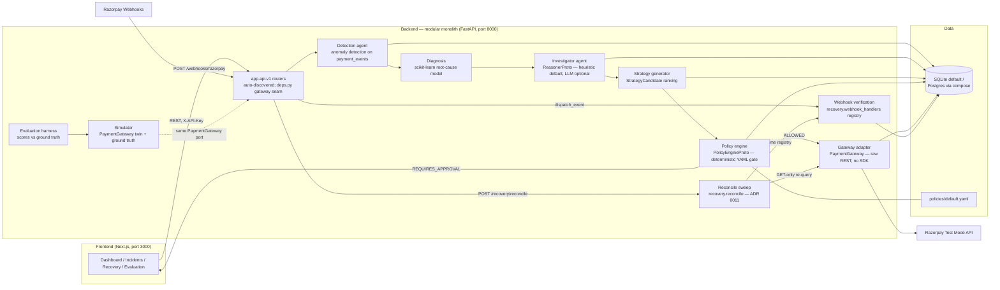
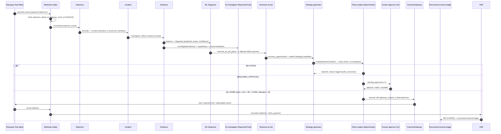

# PulseRecover — System Architecture

AI Payment Reliability & Revenue Recovery Engine (Razorpay AI Buildathon, Track 03).

> **Guiding principle:** Probabilistic AI proposes. Deterministic policy decides.
> Payment infrastructure executes. Verification proves.

> **Companion documents:** [docs/data-flow.md](data-flow.md) walks every loop
> end to end (detection → investigation → recovery → webhook verification →
> reconciliation → evaluation) with transaction boundaries;
> [docs/security-architecture.md](security-architecture.md) draws the trust
> boundaries and the financial-action safety controls. This document is the
> component map both refer to.

## 1. Architectural style: modular monolith (ADR 0001)

One FastAPI backend process, organized as strictly separated modules with
**ports** (`backend/app/ports.py`) as the only coupling between them. Feature
slices are fully built out (router + schemas + service package) and integrate
through the ports and the shared models — no module reaches into another's
internals. The dependency directions between modules are not conventions;
they are **enforced by `backend/tests/architecture/test_boundaries.py`**
(ADR 0010, see §4). This gives microservice-grade separation of concerns with
single-process operability: one `uvicorn`, one database, one
`docker compose up` for the judges.

Module boundaries:

```
app/
  config.py        pydantic-settings (env-driven, .env at repo root)
  logging.py       JSON structured logging, request-id, secret redaction
  db.py            engine/session/Base/TZDateTime (SQLite default, PG via env)
  ids.py           prefixed id helpers (inc_, pay_, act_, ...)
  ports.py         THE CONTRACT: PaymentGateway, PolicyEngineProto, ReasonerProto,
                   enums, ActionContext, PolicyDecision, StrategyCandidate
  models/          SQLAlchemy 2.x models — the shared data contract (21 tables)
  schemas/         Pydantic v2 request/response — the frontend contract
  api/
    deps.py        THE single gateway dependency seam (one override point)
    v1/            routers, auto-discovered (one file per domain)
  services/
    policy/        deterministic core: YAML gate, audit writer, history (leaf)
    revenue/       revenue-at-risk + expected-recovery quantification (leaf)
    detection/     anomaly detectors + incident engine over 4 metric series
                   (payment_success_rate, capture_latency_ms,
                   checkout_abandonment_rate, insufficient_fund_share) (leaf)
    diagnosis/     ML root-cause model: features, prod-frame labeling,
                   calibrated training, artifacts (leaf)
    insights/      failure-facet outlier ranking + platform callout (leaf)
    razorpay/      PaymentGateway adapter: raw REST client + simulator twin (leaf)
    recovery/      execution engine: builder, strategies, executor,
                   webhook_handlers (verification registry), reconcile (sweep)
    agent/         AI investigator: reasoners (confidence caps, escalation
                   floors), tool whitelist, hallucination guard, reports
    evaluation/    experiment harness (second composition root; drives the
                   simulator + services + webhook registry in scratch DBs)
  simulator/       deterministic synthetic payment environment + ground truth
  main.py          app factory, middleware, error envelope — never edited again
```

**Router auto-discovery:** `app.main` pkgutil-scans `app.api.v1` and includes
every module exposing a module-level `router` — adding a domain means adding
one file; `main.py` never changes.

## 2. Component diagram



## 3. Closed-loop data flow



If verification cannot prove the outcome (lost webhook, ambiguous gateway
state), the action lands in `UNKNOWN` — never silently counted as recovered,
never blind-retried. Two repair paths exist, both truthful: manual re-execute
(one opportunity; delegates to `executor.resolve`, GETs only) and the
**operator-triggered reconciliation sweep** (`POST /api/v1/recovery/reconcile`,
ADR 0011), which re-queries every UNKNOWN action against gateway truth and
re-runs every `processed=false` webhook event through the same handler
registry as live intake. Three consecutive failed recoveries on one incident
trip the **stopping rule** (`policies/default.yaml`); further automation is
blocked until a human reviews.

## 4. Dependency matrix (enforced, ADR 0010)

The sanctioned import directions, mirrored verbatim from
`backend/tests/architecture/test_boundaries.py` — **that test is the source of
truth and fails CI on any violation**. "Leaf" = may import only the shared
contracts (`app.models`, `app.ports`, `app.config`, `app.db`, `app.ids`,
`app.logging`, `app.schemas`) plus itself.

| Package | May import (beyond shared contracts) | Must NOT import |
|---|---|---|
| `services.policy` | — (leaf) | any other `services.*`, `api`, `simulator` |
| `services.revenue` | — (leaf) | any other `services.*`, `api`, `simulator` |
| `services.detection` | — (leaf; `schemas` sanctioned) | any other `services.*`, `api`, `simulator` |
| `services.insights` | — (leaf) | any other `services.*`, `api`, `simulator` |
| `services.diagnosis` | — (leaf) | any other `services.*`, `api`, `simulator` |
| `services.razorpay` | — (leaf adapter) | any other `services.*` (incl. `insights`), `api`, `simulator` |
| `services.recovery` | `services.{policy, revenue, razorpay.errors}` (sanctioned: executor gates through policy, strategies price via revenue) | `services.agent`, `api`, `simulator` |
| `services.agent` | `services.{diagnosis, policy, revenue}` (sanctioned: composes diagnosis, gates via policy tools) | `services.razorpay`, `simulator`, `api` |
| `simulator` | — | `services` |
| `services.evaluation` | harness exemption: `services`, `simulator`, `api.v1.webhooks.EVENT_HANDLERS` — second composition root, never on the serving path | — |
| `api.*` | everything — the composition root | — |

Two invariants worth calling out: the **agent can never reach the gateway**
(AI has no money-movement path) and the **policy engine depends on nothing
probabilistic** (the deterministic core cannot be poisoned by the loop it
gates). A new `services.*` package fails the suite until it is ruled or
explicitly exempted in the test.

## 5. Request traceability story

Every request is traceable end to end:

1. **Frontend → API:** the UI calls e.g. `POST /api/v1/recovery/{id}/execute`
   with `X-API-Key` (mutating routes; demo/detection exempt outside prod) and an
   optional `X-Request-ID`. `RequestIdMiddleware` assigns/echoes the id; every
   log line and every `audit_logs.request_id` carries it.
2. **API → agent:** the recovery agent builds a `StrategyCandidate` and an
   `ActionContext`; a `recovery_actions` row appears (`PROPOSED`; actor is the
   caller-supplied `human:...` on the execute route, or `agent:investigator`
   for agent-tool requests).
3. **Agent → policy:** `PolicyEngineProto.evaluate()` returns a `PolicyDecision`;
   an immutable `policy_decisions` row stores outcome, reasons, rules matched,
   policy version. The LLM/reasoner is **never** on this path (ADR 0004).
4. **Policy → gateway:** on ALLOWED, the gateway adapter executes with
   `gateway_request_id` = idempotency key (unique column — retries cannot
   double-execute). Raw request/response land on the action row.
5. **Gateway → webhook → db:** Razorpay's callback hits `/webhooks/razorpay`
   (thin ingress adapter); signature verified, `webhook_events.gateway_event_id`
   UNIQUE dedupes retries, then `dispatch_event` runs the
   **`services.recovery.webhook_handlers` registry** — verification logic lives
   in the service layer so intake, the reconcile sweep, and the evaluation
   harness share one code path — and the action transitions
   `EXECUTING → VERIFYING → RECOVERED | FAILED | UNKNOWN`.
6. **Reconciliation:** `POST /api/v1/recovery/reconcile` sweeps UNKNOWN actions
   (GET-only gateway re-query via `executor.resolve`) and `processed=false`
   webhook events (same registry), and writes one `recovery.reconcile` audit
   row with the sweep report (ADR 0011).
7. **Ledger:** recovered amounts roll up into the dashboard summary and the
   evaluation harness compares them against `simulator_ground_truth`.

## 6. Money convention

**All money is integer paise (INR), everywhere** — internal fields, DB columns
(`*_paise`), API payloads (`"amount_paise": 500000, "currency": "INR"`). No
floats, no mixed units. Policy thresholds are written in INR in
`policies/default.yaml` for readability and converted to paise at load time
(`max_amount_inr: 5000` → `500000` paise).

## 7. Safety model

- **Deterministic gate (ADR 0003):** every financial action passes the policy
  engine. AI output is advisory input, never an execution path.
- **Idempotency:** `gateway_request_id` unique; webhook dedup via unique
  `gateway_event_id`; safe retries end to end.
- **Stopping rules:** max attempts per opportunity, max 3 consecutive failed
  recoveries per incident/strategy, rate limits per incident/customer/global.
- **Hard blocks:** refunds, irreversible actions, and opted-out customers are
  never auto-executed.
- **UNKNOWN state:** unverifiable outcomes are surfaced, not guessed —
  resolution is GET-only, manually or via the reconcile sweep.
- **Fail-closed webhook intake:** invalid HMAC → 400 before any parsing;
  handler failure keeps the event (`processed=false`) for the sweep.

## 8. Observability model

- **Structured logs:** stdlib JSON formatter, one object per line, `request_id`
  on every line via contextvar; secret-looking keys (`*secret*`, `*key*`,
  `*token*`, ...) redacted recursively (`app/logging.py`).
- **Audit trail:** `audit_logs` is append-only; every state transition of
  incidents, opportunities, and actions writes a row with actor + request_id,
  and each reconcile sweep appends one `recovery.reconcile` row carrying its
  full report (`sweep_id` = `rcn_...`).
- **Auditability of AI:** every model inference in `model_predictions` (with
  model name/version), every agent run in `agent_reports` (input, output,
  model, tokens, duration); every policy decision persists `policy_version`
  (sha256 of the YAML config) so a decision can be replayed against the exact
  rules that produced it.
- **Health:** `/healthz` (liveness), `/readyz` (DB check),
  `/api/v1/system/health` (DB, policy file, LLM provider, gateway mode).
- **Metrics/evaluation:** `evaluation_runs` + `GET /api/v1/evaluation/metrics`
  expose detection precision/recall/F1, MTTD/MTTR, recovery rate, and
  false-action rate — computed against simulator ground truth (ADR 0005).

## 9. Testing & evaluation strategy

- `backend/tests` — smoke + unit + integration tests on in-memory SQLite
  (`StaticPool`); `tests/architecture/test_boundaries.py` statically enforces
  the §4 dependency matrix over `app/**/*.py` (ADR 0010).
- The **simulator** implements the same `PaymentGateway` port as the Razorpay
  adapter and records what it injected in `simulator_ground_truth`, enabling
  scientific scoring (precision/recall of detection, diagnosis accuracy,
  recovery rate) rather than demo anecdotes.
- `contracts/openapi.json` is generated (`scripts/export_openapi.py`) and
  committed; the frontend generates its client from it.
